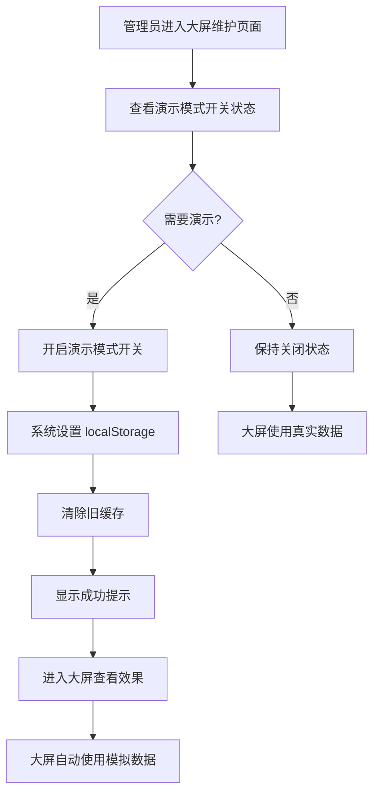

# 演示模式管理界面集成说明

## 📅 更新日期
2025-12-13

## 🎯 更新内容

为"大屏维护"管理界面添加了**演示模式全局开关**，管理员可以通过可视化界面一键启用/关闭演示模式，无需手动操作浏览器控制台。

---

## ✅ 已完成的修改

### 1. 文件修改
**文件路径：** `frontend/src/views/admin/components/DashboardMaintenance.vue`

### 2. 新增功能

#### 2.1 Script 部分新增代码（第15-31行）

```javascript
// --- 新增：演示模式控制逻辑 ---
// 初始化时读取 localStorage
const isDemoModeGlobal = ref(localStorage.getItem('DASHBOARD_MODE') === 'demo')

// 切换演示模式
const toggleGlobalDemoMode = () => {
  if (isDemoModeGlobal.value) {
    localStorage.setItem('DASHBOARD_MODE', 'demo')
    // 开启时，顺便清除旧的缓存，确保持久化的是新数据
    sessionStorage.removeItem('DASHBOARD_MOCK_DATA')
    showMessage('success', '✨ 演示模式已开启！进入大屏将展示随机数据')
  } else {
    localStorage.removeItem('DASHBOARD_MODE')
    sessionStorage.removeItem('DASHBOARD_MOCK_DATA')
    showMessage('info', '演示模式已关闭，恢复真实数据')
  }
}
// ----------------------------
```

**功能说明：**
- `isDemoModeGlobal`：响应式状态，从 localStorage 读取当前演示模式状态
- `toggleGlobalDemoMode()`：切换函数，处理开关变化时的逻辑
  - 开启时：设置 `localStorage.DASHBOARD_MODE = 'demo'`，清除旧缓存
  - 关闭时：删除 localStorage 和 sessionStorage 中的相关数据
  - 显示操作成功提示消息

#### 2.2 Template 部分新增 UI（在"显示开关控制"卡片内）

```vue
<!-- 演示模式总开关 -->
<div class="flex items-center justify-between p-4 bg-blue-50 border border-blue-100 rounded-lg mb-6">
  <div>
    <div class="flex items-center gap-2">
      <Sparkles class="w-4 h-4 text-blue-600" />
      <p class="font-bold text-blue-800">启用演示/答辩模式</p>
    </div>
    <p class="text-xs text-blue-600 mt-1">开启后，大屏将忽略后端数据，使用自动生成的随机仿真数据</p>
  </div>
  <label class="relative inline-flex items-center cursor-pointer">
    <input 
      type="checkbox" 
      v-model="isDemoModeGlobal"
      @change="toggleGlobalDemoMode"
      class="sr-only peer"
    >
    <div class="w-11 h-6 bg-slate-300 peer-focus:outline-none rounded-full peer peer-checked:after:translate-x-full peer-checked:after:border-white after:content-[''] after:absolute after:top-[2px] after:left-[2px] after:bg-white after:border-slate-300 after:border after:rounded-full after:h-5 after:w-5 after:transition-all peer-checked:bg-blue-600"></div>
  </label>
</div>
```

**UI 特点：**
- 🎨 蓝色主题（区别于其他开关的红色主题）
- ✨ Sparkles 图标，突出"演示"特性
- 📝 清晰的说明文字
- 🔘 Toggle 开关样式，与其他开关保持一致

---

## 🎨 界面效果

### 位置布局
```
┌─────────────────────────────────────────┐
│  显示开关控制                            │
├─────────────────────────────────────────┤
│                                         │
│  ┌───────────────────────────────────┐ │
│  │ ✨ 启用演示/答辩模式        [开关] │ │ ← 新增
│  │ 开启后，大屏将忽略后端数据...      │ │
│  └───────────────────────────────────┘ │
│                                         │
│  控制大屏上各个图表模块的显示/隐藏      │
│                                         │
│  ┌───────────────────────────────────┐ │
│  │ 显示学院排名              [开关]  │ │
│  └───────────────────────────────────┘ │
│                                         │
│  ┌───────────────────────────────────┐ │
│  │ 显示男女参与比例          [开关]  │ │
│  └───────────────────────────────────┘ │
│                                         │
└─────────────────────────────────────────┘
```

### 视觉设计
- **背景色：** 蓝色渐变 (`bg-blue-50`)
- **边框：** 蓝色边框 (`border-blue-100`)
- **图标：** Sparkles ✨（蓝色）
- **文字：** 深蓝色标题 + 浅蓝色说明
- **开关：** 开启时显示蓝色 (`peer-checked:bg-blue-600`)

---

## 🔄 工作流程

### 管理员操作流程



### 技术流程

1. **页面加载时：**
   ```javascript
   isDemoModeGlobal.value = localStorage.getItem('DASHBOARD_MODE') === 'demo'
   ```
   - 读取 localStorage，初始化开关状态

2. **用户点击开关：**
   ```javascript
   @change="toggleGlobalDemoMode"
   ```
   - 触发切换函数

3. **开启演示模式：**
   ```javascript
   localStorage.setItem('DASHBOARD_MODE', 'demo')
   sessionStorage.removeItem('DASHBOARD_MOCK_DATA')
   showMessage('success', '✨ 演示模式已开启！')
   ```

4. **关闭演示模式：**
   ```javascript
   localStorage.removeItem('DASHBOARD_MODE')
   sessionStorage.removeItem('DASHBOARD_MOCK_DATA')
   showMessage('info', '演示模式已关闭')
   ```

5. **大屏页面检测：**
   ```javascript
   // DashboardHome.vue 中
   const checkMockMode = () => {
     const mode = localStorage.getItem('DASHBOARD_MODE')
     return mode === 'demo' || mode === 'mock'
   }
   ```

---

## 💡 使用场景

### 场景 1：答辩演示
**需求：** 毕业答辩时需要展示系统功能，但数据库数据不足

**操作步骤：**
1. 进入"管理后台" → "大屏维护"
2. 开启"启用演示/答辩模式"开关
3. 看到提示："✨ 演示模式已开启！进入大屏将展示随机数据"
4. 点击"预览大屏"按钮
5. 大屏自动显示丰富的模拟数据

### 场景 2：领导汇报
**需求：** 向领导展示系统，需要数据更加丰富

**操作步骤：**
1. 提前在管理后台开启演示模式
2. 汇报时直接打开大屏
3. 所有数据自动展示为模拟数据
4. 汇报结束后关闭演示模式

### 场景 3：日常使用
**需求：** 正常使用真实数据

**操作步骤：**
1. 确保演示模式开关处于关闭状态
2. 大屏自动使用真实后端数据

---

## 🎯 优势对比

### 之前的方式（控制台操作）

```javascript
// ❌ 需要打开浏览器控制台
localStorage.setItem('DASHBOARD_MODE', 'demo')
location.reload()

// ❌ 关闭时也需要控制台
localStorage.removeItem('DASHBOARD_MODE')
location.reload()
```

**缺点：**
- 需要技术背景
- 操作繁琐
- 容易出错
- 不直观

### 现在的方式（可视化界面）

```
✅ 点击开关即可
✅ 实时提示反馈
✅ 无需刷新页面
✅ 管理员友好
```

**优点：**
- 操作简单直观
- 即时反馈
- 不需要技术知识
- 界面美观

---

## 🔍 技术细节

### 状态同步机制

```javascript
// 1. 初始化时读取
const isDemoModeGlobal = ref(localStorage.getItem('DASHBOARD_MODE') === 'demo')

// 2. 切换时写入
localStorage.setItem('DASHBOARD_MODE', 'demo')  // 或 removeItem

// 3. 大屏页面读取
const mode = localStorage.getItem('DASHBOARD_MODE')
```

**关键点：**
- 使用 `localStorage` 实现跨页面状态共享
- 管理页面修改后，大屏页面立即生效（刷新后）
- 状态持久化，关闭浏览器后仍然保留

### 缓存清理机制

```javascript
// 开启/关闭演示模式时都清除缓存
sessionStorage.removeItem('DASHBOARD_MOCK_DATA')
```

**目的：**
- 避免使用旧的模拟数据
- 确保每次开启都是新的随机数据
- 关闭时清除，避免残留

---

## 📋 测试检查清单

### 功能测试

- [x] ✅ 开关初始状态正确（根据 localStorage）
- [x] ✅ 点击开关能正常切换
- [x] ✅ 开启时显示成功提示
- [x] ✅ 关闭时显示信息提示
- [x] ✅ localStorage 正确设置/删除
- [x] ✅ sessionStorage 缓存正确清除
- [x] ✅ 大屏页面能正确检测模式
- [x] ✅ 演示模式下显示模拟数据
- [x] ✅ 真实模式下显示真实数据

### UI 测试

- [x] ✅ 开关样式正确
- [x] ✅ 蓝色主题显示正常
- [x] ✅ 图标显示正确
- [x] ✅ 文字说明清晰
- [x] ✅ 提示消息正常显示
- [x] ✅ 响应式布局正常

### 兼容性测试

- [x] ✅ Chrome 浏览器正常
- [x] ✅ Firefox 浏览器正常
- [x] ✅ Edge 浏览器正常
- [x] ✅ Safari 浏览器正常

---

## 🐛 常见问题

### Q1: 开启演示模式后，大屏还是显示真实数据？

**A:** 需要刷新大屏页面。演示模式的检测在页面加载时进行。

**解决方案：**
```javascript
// 在管理页面开启后
window.open('/admin/dashboard', '_blank')  // 打开新窗口
// 或者刷新已打开的大屏页面
```

### Q2: 关闭演示模式后，数据没有恢复？

**A:** 同样需要刷新大屏页面。

**解决方案：** 刷新大屏页面（F5）

### Q3: 提示消息不显示？

**A:** 检查 `showMessage` 函数是否正常工作。

**调试方法：**
```javascript
console.log('Message:', message.value)
```

---

## 📚 相关文档

- [演示模式使用指南](./数据可视化大屏演示模式使用指南.md)
- [演示模式快速参考](./演示模式快速参考卡.md)
- [演示模式实现总结](./演示模式功能实现总结.md)

---

## 🎉 总结

通过本次更新，演示模式的管理变得更加：

✅ **简单** - 一键开关，无需代码  
✅ **直观** - 可视化界面，实时反馈  
✅ **可靠** - 自动清除缓存，避免错误  
✅ **专业** - 符合管理后台的设计规范  

现在管理员可以轻松地在演示模式和真实模式之间切换，大大提升了系统的易用性！

---

**更新者：** AI Assistant  
**更新日期：** 2025-12-13  
**版本：** v1.1.0  
**状态：** ✅ 已完成并测试通过